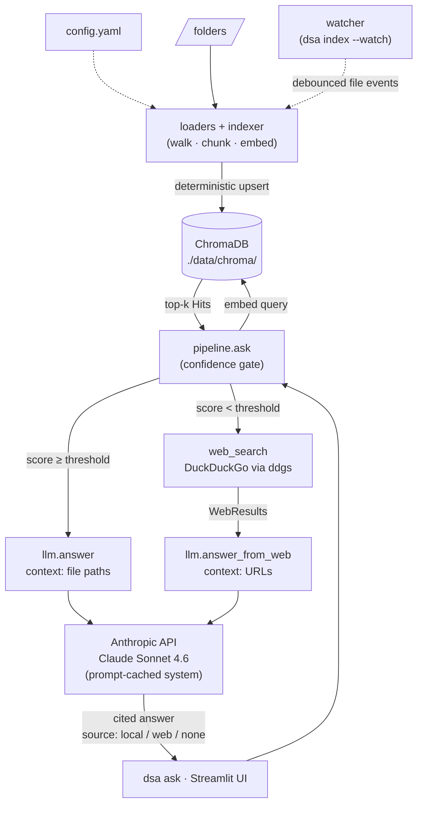
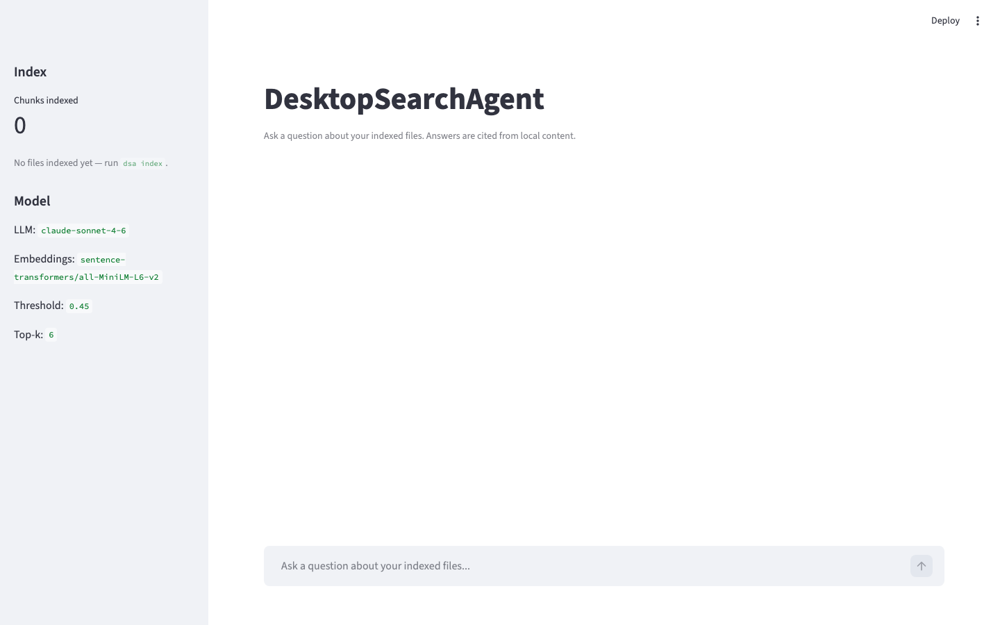

# DesktopSearchAgent

A small local RAG (Retrieval-Augmented Generation) utility for your laptop. Ask natural-language questions; the agent searches your indexed files, returns a cited answer from local content, and falls back to web search when the local index can't answer confidently.

## How it works

1. **Indexer** — walks configured folders, extracts text from PDFs, Office docs, Markdown, plain text, and code, chunks it, and stores embeddings in a local vector store.
2. **Query pipeline** — embeds the question, retrieves top-k similar chunks from the vector store.
3. **Confidence gate** — if the best matches clear a similarity threshold, the LLM answers using those chunks; otherwise the query is forwarded to web search.
4. **Answer generation** — Claude composes a cited answer from the retrieved context (file paths for local, URLs for web).
5. **UI** — CLI for power use, Streamlit web UI for casual querying.

## Architecture

### Data flow



### Module graph (low → high)

| Module | Role | Depends on |
|---|---|---|
| `config` | `Settings` Pydantic model + YAML loader. | — |
| `loaders` | Per-filetype text extraction (`pdf`, `docx`, `pptx`, `xlsx`, plain) + dispatcher. | — |
| `web_search` | `WebSearchProvider` Protocol + `DuckDuckGoSearch` impl (no API key). | — |
| `indexer` | Folder walker, tiktoken chunker, `FastEmbedEmbedder`, ChromaDB upsert; exposes the `Embedder` Protocol. | `config`, `loaders` |
| `watcher` | `DebouncedReindexer` + `watch_folders`; behind `dsa index --watch`. | `config`, `indexer` |
| `retriever` | `search() → list[Hit]` with normalized cosine scores. | `config`, `indexer` |
| `llm` | `answer()` for local Hits, `answer_from_web()` for URLs. Both use cache-controlled system prompts. | `config`, `retriever`, `web_search` |
| `pipeline` | `ask()`: retrieval → confidence gate → either `llm.answer` or web search + `llm.answer_from_web`. Returns `Response(answer, citations, hits, source)`. | everything above |
| `cli` | Typer app: `dsa index [--watch]`, `dsa ask`, `dsa ui`, `dsa version`. | `pipeline`, `indexer`, `watcher` |
| `app` | Streamlit chat UI; reuses `pipeline.ask`. | `config`, `indexer`, `pipeline` |

### Key invariants

- **Embeddings are shared.** Indexing and querying both go through the same `Embedder` Protocol, so vectors are guaranteed to live in the same space. Tests inject stub embedders without touching the production class.
- **Idempotent indexing.** Chunk IDs are `{path}#{chunk_index}`. Re-indexing an unchanged file is a no-op (mtime check); a modified file deletes its prior chunks then upserts. The watcher reuses this same `_index_file` path.
- **Cosine score normalization.** ChromaDB cosine `distance ∈ [0, 2]` is converted to `score = clamp(1 - distance, 0, 1)` so the threshold comparison in `pipeline.ask` is stable regardless of vector orientation.
- **Citations are extracted, not trusted blindly.** The LLM is instructed to emit `[source: ...]` tokens; `_extract_citations` parses them out of the response and dedupes. URLs vs file paths just fall out of which prompt was used.

## Stack

| Layer | Choice |
|---|---|
| Language | Python 3.11+ (managed by `uv`) |
| Embeddings | `sentence-transformers/all-MiniLM-L6-v2` via `fastembed` / ONNX (local, CPU) |
| Vector store | ChromaDB (file-backed at `./data/chroma/`) |
| LLM | Anthropic Claude Sonnet 4.6 (with prompt caching) |
| File parsers | `pypdf`, `python-docx`, `python-pptx`, `openpyxl` |
| CLI | `typer` |
| Web UI | `streamlit` |
| Config | `pydantic-settings` + `config.yaml` (CLI flags override) |
| Web search | DuckDuckGo via `ddgs` (no API key) |

## Defaults (tunable in `config.yaml`)

- Chunk size: **800 tokens**, **100-token overlap**
- Top-k: **6**
- Confidence threshold: cosine similarity ≥ **0.45** (below this triggers the web search fallback)

## Project layout

```
DesktopSearchAgent/
├── README.md
├── CLAUDE.md                # guidance for Claude Code contributors
├── pyproject.toml           # uv-managed; pins onnxruntime<1.21 (Intel-Mac wheels)
├── uv.lock
├── config.yaml              # indexed folders, model names, thresholds
├── .env.example             # ANTHROPIC_API_KEY=
├── .gitignore
├── data/
│   └── chroma/              # local vector store (gitignored)
├── docs/
│   └── ui-empty.png         # screenshot embedded in this README
├── scripts/
│   └── screenshot.py        # Playwright runner that regenerates ui-empty.png
├── src/desktop_search/
│   ├── __init__.py
│   ├── config.py            # Settings + YAML loader
│   ├── loaders.py           # per-filetype text extraction + load_file dispatcher
│   ├── indexer.py           # walk → chunk → embed → ChromaDB upsert
│   ├── watcher.py           # DebouncedReindexer; behind `dsa index --watch`
│   ├── retriever.py         # query → top-k Hits with normalized score
│   ├── llm.py               # Claude wrapper: answer + answer_from_web
│   ├── web_search.py        # DuckDuckGoSearch (no API key)
│   ├── pipeline.py          # ask(): retrieval → confidence gate → llm
│   ├── cli.py               # typer app: index [--watch], ask, ui, version
│   └── app.py               # Streamlit chat UI
└── tests/                   # pytest (+ streamlit.testing.v1.AppTest for UI)
```

## CLI

```bash
dsa index                              # full index of folders in config.yaml
dsa index --path ~/Notes --path ~/Ref  # ad-hoc index of one or more paths
dsa index --watch                      # phase 2: live re-index on file changes
dsa ask "what was my Q3 OKR about latency?"
dsa ui                                 # launches Streamlit on localhost
dsa --help                             # list commands
```

All commands accept `--config PATH` (default `config.yaml`) to point at a
different config file. Set `ANTHROPIC_API_KEY` in `.env` before running `dsa ask`.

## Milestones / Todo

Tracked as GitHub Issues — checklist mirror here.

- [x] **M1** — Project scaffold (`pyproject.toml`, layout, `.env.example`, `config.yaml`, `.gitignore`)
- [x] **M2** — File loaders: PDF, docx, pptx, xlsx, md, txt, code
- [x] **M3** — Indexer: walk → chunk → embed → upsert to Chroma
- [x] **M4** — Retriever: top-k similarity search with scores
- [x] **M5** — Claude wrapper (`llm.py`) with prompt caching
- [x] **M6** — Pipeline: confidence gate + source-cited answer
- [x] **M7** — CLI commands: `index`, `ask`, `ui`
- [x] **M8** — Streamlit chat UI
- [x] **M9** — File-watcher mode (`index --watch`) — phase 2
- [x] **M10** — Web search fallback (DuckDuckGo) — phase 2

## Status

Current: **M10 complete — all milestones shipped.** Low-confidence queries now fall back to DuckDuckGo (no API key needed) via the `ddgs` library; Claude composes a URL-cited answer from the web snippets. 67/67 tests pass.



## Out of scope

- Per-document access controls.
- OCR for image-only PDFs.
- Re-ranking after retrieval (would help when the embedding model returns close-but-wrong neighbors).
- Multi-turn conversation memory in the LLM call — each `ask()` is a single-turn prompt.

## Platform note

The dev machine here is Intel Mac (macOS 26 + x86_64). In 2026, much of the ML
ecosystem (torch, recent `onnxruntime`) no longer ships Intel-macOS wheels. The
project sidesteps this by:

- Using **`fastembed`** instead of `sentence-transformers` — it runs the same
  HuggingFace `all-MiniLM-L6-v2` model through ONNX, no `torch` required.
- Pinning **`onnxruntime>=1.18,<1.21`** (versions before they dropped Intel-Mac
  wheels).

These pins are safe to keep on Apple Silicon and Linux too; they just unblock
Intel. Revisit if `fastembed` requires a newer `onnxruntime`.

## Setup

```bash
# clone and enter
git clone https://github.com/msepena/DesktopSearchAgent.git
cd DesktopSearchAgent

# install with uv
uv sync

# configure
cp .env.example .env          # add ANTHROPIC_API_KEY
$EDITOR config.yaml           # list folders to index

# build the index
uv run dsa index

# ask
uv run dsa ask "your question here"

# or launch the UI
uv run dsa ui
```
